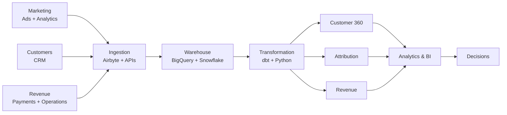

# Abdiwahid Ali

### Data Engineer | Customer & Marketing Data

I’m a Data Engineer specializing in **customer and marketing data**.

I build the systems that collect, track, transform, and connect marketing activity with **customers, conversions, and revenue**.

From campaign tracking and data pipelines to attribution and revenue reconciliation, I make marketing performance **measurable, traceable, and reliable**.

- **Customer Data:** Customer 360, segmentation, cohorts, retention, churn, and LTV
- **Marketing Data:** Campaign tracking, ad platforms, analytics, CRM, and conversion data
- **Attribution:** Connecting marketing touchpoints to customers, conversions, and revenue
- **Data Engineering:** Pipelines, warehouses, dbt, data quality, modeling, and automation

---

## Architecture

---

  
  
  
  
  
  
  
  
  
  
  
  
  
  
  
  
  
  
  
  
  
  
  
  
  
  
  
  

---

**Build the pipeline. Verify the number. Follow it to the money.**

